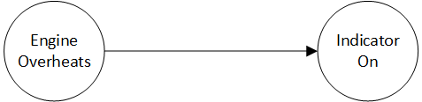
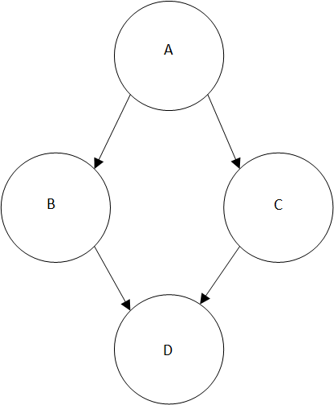

# Answers to the exercises

_Note: click the "show formulas" button to show some of the formulas_
## Exercises (1)

1. \`probability of Rafflewin is 5/100\` and next \`probability of Rafflewin\`
2. \`probability of no Rafflewin\`
3. \`probability of SaturdayRain is 200/1000\`
4. \`probability of no SaturdayRain\`
5. \`probability of ProjectFail is 20/100\`

## Exercises (2)

1. \`probability of RainSaturday and RainSunday\`
2. \`probability of RainSaturday and no RainSunday\`

## Exercises (3)

2. The probability of engine overheating: \`prob Overheat=25%\` The probability of indicator lighting up, given that the engine overheats: \`prob IndicatorOn given Overheat = 85%\`
3. \`prob IndicatorOn\`

## Exercises (4)

### Part 1

1. The probability of the analyst being correct _depends_ on Ann, Bob, or Charlie being correct (to different degrees).  Therefore, if the analyst is _known_ to be correct, then chances are that one or more of them was correct.  All of the probabilities of being correct for Ann, Bob, and Charlie go up.
2. \`percent prob BobCorrect given AnalystCorrect\`
3. The probability of the analyst being correct depends less on Bob than it does on Ann

### Part 2

* \`probability of APurchase is 80%\`
* \`probability of BShipment given APurchase is 70%\`
* \`probability of CShipment given APurchase is 30%\`
* \`probability of DNotice given BShipment is 80%\`
* \`probability of DNotice given CShipment is 20%\`

3. \`percent probability of DNotice\`%
4. The percent chance of APurchase given DNotice is \`percent chance of APurchase given DNotice?\`%, because if the shipment was noticed then it could only have come from A (in this problem statement).
5. \`percent prob BShipment given DNotice?\`