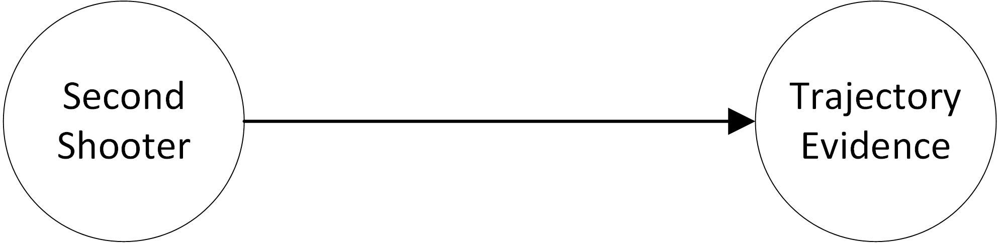
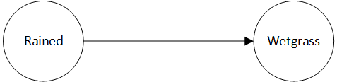

# Conditional probabilities

Suppose a murder investigation has the following statement: "There is some chance (40%) that there was a second shooter. If there was a second shooter, then in all likelihood (95%) the forensic evidence of the bullet trajectory would indicate that".  Based on this statement, what is the probability that there was a second shooter?

The figure above shows the problem as a diagram.  We have two variables "TrajectoryEvidence" and "SecondShooter", both of which are the usual probability variables (i.e. they can be true or false to a degree).  We also have an arrow which represents "...would indicate that". This situation, where variables are linked is called a _conditional probability_.  We can write it with probability statements as follows:

* The probability of SecondShooter is 40%
* The probability of TrajectoryEvidence given SecondShooter is 95%

Note that the second sentence does **not** say that the probability of the TrajectoryEvidence **is** 95%. It says that **if** SecondShooter is true **then** the probability that we'll see it in the TrajectoryEvidence is  95%.

Once we have stated the known probabilities and conditional probabilities, we can calculate the probability in question the usual way.  For example, what is our prediction that we'll get positive trajectory evidence?

* The probability of the trajectory evidence is: probability of TrajectoryEvidence

Let's try another example.  Let's say that if it rained then there is some chance (80%) that we see wet grass (there is a small chance that maybe it dried already). And, there is a 20% chance that it rained.

The probability statements that capture this situation:

* probability of  Rained is 20%
* probability of  Wetgrass given Rained is 80%

Based on the supplied information, the probability that we will see wetgrass is percent prob Wetgrass%.

---

_Shortcut_

Mostly we want to see the probability results as percentages.  An easy way to do this, is to put the keyword "percent" in front of your probability formula. It calculates the result as a whole percentage (no decimal places). Have a look at the formula just above that calculates the probability of Wetgrass. For an even shorter cut, use "%" instead of "percent".  So: \`% prob Wetgrass\` = %prob Wetgrass.

Also, sometimes you want only the result of a formula, but sometimes you want the formula _and_ the result.  A shortcut for that is to put a question mark at the end of the formula (inside the backticks).  That will keep the formula and the result. Like this:

    \`%prob WetGrass?\`

---

Often, we're given information (probabilities and conditional probabilities) that flows in one direction, but our question is really about the reverse direction.  For example, maybe we come home, see the grass is wet, and want to know what the probability is that it rained.  We can simply formulate that as a probability statement:

* percent prob Rained given Wetgrass

There is a very good reason that there is a 100% probability that it rained, if we observe WetGrass. Namely, in this particular problem statement, there is only one way that the grass _could_ be wet -- and that is if it rained.  This type of "reverse" calculation gets more complicated in problems with multiple variables, which we'll look at in the next section.

### Exercises (3)

Assume that in the desert the following is the case. There is a 25% chance that your engine will overheat.  If the engine overheats, it is very likely (85%) that the overheating indicator will light up on your dashboard. 

1. Show the probability variables and relationship a diagram
2. How can the given information be captured as probability statements?
3. What is the probability that the "overheating" indicator light will go on?

<form id="form1">
  <textarea id="editor1" name="editor1" cols=80>
    
Type your formulas below (don't forget the backticks)

  </textarea>
  <input id="CalcButton" type="button" value="Calculate"/>
  
</form>

