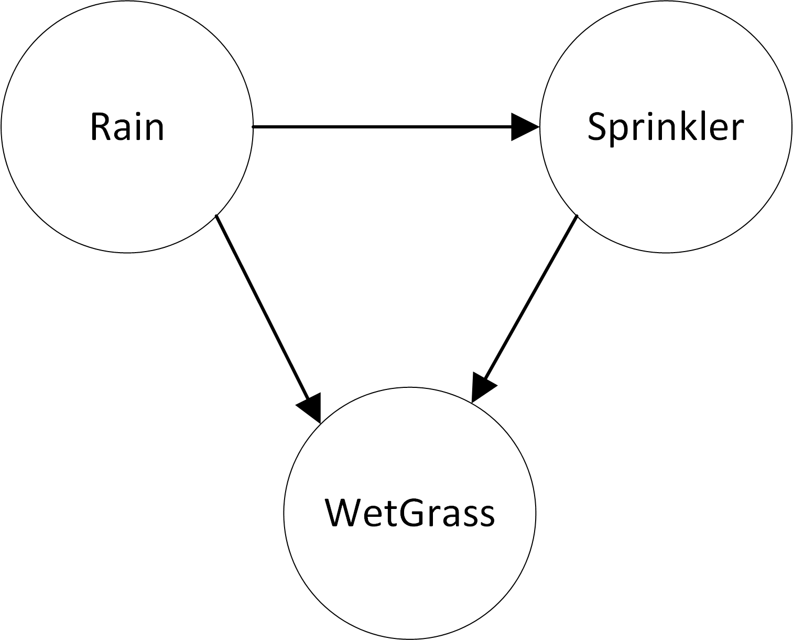

# Networks of probabilities

Networks of probabilities (mostly conditional probabilities) are often called "Bayesian Networks". However, they are merely more elaborate versions of the conditional probabilities that we saw earlier.  Here is the classical _wet grass_ example:

* \`probability of Rain is 20%\`
* \`probability of SprinklerOn given Rain is 1%\`
* \`probability of SprinklerOn given no Rain is 40%\`
* \`probability of WetGrass given no Rain and no SprinklerOn is 0\`
* \`probability of WetGrass given Rain and no SprinklerOn is 80%\`
* \`probability of WetGrass given no Rain and SprinklerOn is 90%\`
* \`probability of WetGrass given Rain and SprinklerOn is 99%\`

Once we have entered the provided information, we can then do calculations like:

* The percent chance of wet grass: \`percent prob WetGrass\`%

The reverse calculation of seeing wet grass and wondering about its cause, becomes more interesting. For example,

* The percent chance that it was rain causing the wet grass: \`percent probability of Rain given WetGrass\`%

The reason that the above result is less than 100% is that Rain is now no longer the only possible cause of wet grass.  The chances that there was Rain goes up, because we see wet grass. However, the chance does not go up all the way to 100, because it could be the sprinkler that caused the wet grass.

Let's do another example.  In this example, you are an intelligence analyst with three possible sources: Ann, Bob and Charlie.  Each of them has an even chance of being right when they warn you of a threat.  In turn, if Ann gives you information, then you have a 90% chance of drawing the right conclusion. Based on Bob's info, you have a 50% chance of drawing the right conclusion. Lastly, Charlie is least reliable -- you have a 10% chance of drawing the right conclusion from his intel. Based on your conclusion, action will be taken and part of that action will be to report findings on whether results match the sources and analysis. The findings have 90% chance of matching if your conclusion was true, and a 10% chance of matching if your conclusion was false.

We can enter the provided information as the following probability statements:

* \`probability of AnnCorrect is 50%\`
* \`probability of BobCorrect is 50%\`
* \`probability of CharlieCorrect is 50%\`
* \`probability of AnalystCorrect given AnnCorrect is 90%\`
* \`probability of AnalystCorrect given BobCorrect is 50%\`
* \`probability of AnalystCorrect given CharlieCorrect is 10%\`
* \`probability of FindingMatches given AnalystCorrect is 90%\`
* \`probability of FindingMatches given not AnalystCorrect is 10%\`

Once we've entered the provided information, we can calculate various answers:

* The probability that the analyst draws the correct conclusions: \`%prob AnalystCorrect?\`
* The probability that the findings match the analysis: \`%prob FindingMatches?\`
* A "reverse" calculation: what is the probability that Ann is correct, if the analyst draws the correct conclusions? \`percent probability of AnnCorrect given AnalystCorrect?\`

### Exercises (4)

#### Part 1

1. Why does the probability that Ann is correct go up when the Analyst is correct?
2. What is the percent chance that Bob is correct, given that the Analyst is correct?
3. Why does Bob's chance of being correct go up less that Ann's, in the case where the Analyst is correct?

#### Part 2

Imagine the following scenario: It is likely (80%) that illegal arms have been purchased in the city A. Smuggled goods from A are mostly (70%) shipped through city B, but sometimes (30%) through city C.  If the shipment is shipped through B, then there is an 80% chance that the arrival in city D will be noticed. If the goods are shipped through C, then the arrival will unlikely (20%) to be noticed in D.

1. Draw a diagram of the probability network of the above problem
2. Translate the problem into probability statements.
3. What is the percent chance that the arms shipment will be noticed in D?
4. What is the percent chance that illegal arms were purchased in Abalastat, if they are noticed in D? why?
5. What is the chance that illegal arms were shipped through B, given that they were noticed in D?

<form id="form1">
  <textarea id="editor1" name="editor1" cols=80>
    
Type your formulas below (don't forget the backticks)

  </textarea>
   <input id="CalcButton" type="button" value="Calculate"/>
  
</form>

