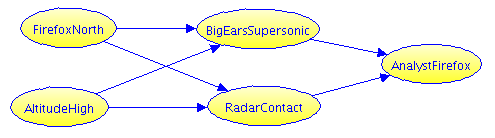

We use Probability Calculator to solve the [SWARM Firefox problem](https://swarm-demo.eresearch.unimelb.edu.au/#/page/f9e915db-e267-41a8-9ce5-adf2a9f9177f).  First we will re-state the problem here so the page is self-contained.

# Problem Description
## Preface
In the ([mediocre](https://www.rottentomatoes.com/m/firefox/)) 1982 movie “Firefox” (based on the [decent](https://www.goodreads.com/book/show/1735608.Firefox) 1977 thriller), US pilot Mitchell Gant steals the Firefox, a fictional top secret supersonic stealth aircraft developed by the Soviet Union.  He initially heads south ensuring he is seen by a commercial airliner before using the stealth properties of the plane to turn north unseen. His plan is to follow the Ural mountains to a clever refueling rendezvous before heading west. Here is our adaptation.
 
##The Problem
Imagine you are the Soviet general in charge of the northern defenses.  You know Gant was last seen heading south. However, your top analyst says Gant is trained in evasion, and suspects it was a diversion and that he is heading north. Here we will depart from the movie a bit to make an interesting but tractable decision problem.

Gant has to go either north or south. You judge there is a 50% chance Gant went north, probably following the Ural mountains. Your team estimates it is three times as likely he is flying at low altitude than at high (i.e. odds are 3:1 in favor of low).

You have two detection systems.

**Acoustic detectors**, known as “**Big Ears**.” These can detect a supersonic aircraft by picking up the sonic boom. Big Ears detects 95% of low-altitude supersonic targets, and 50% of high-altitude targets. It is unlikely any other aircraft would set them off right now, so there is only a 1% false alarm rate.

**Radar**. You know this radar works poorly against a target like Firefox. At best it has a 30% detection, when Firefox is up high presenting a broad target on a clear background. At low altitudes, detection is only 10%.  There is always a 5% false alarm rate, including both system noise, other aircraft, and occasional bird flocks.
 
The sensors are been linked by a simple rules-based system made for
detecting possible NATO stealth test flights in the north (the south
is someone else’s problem):

1. If Radar reports no contact, and BigEars report a supersonic footprint, say “Stealth”.
2. Otherwise, say “No Stealth”.

Your top analyst warns that this system was not designed for stealth as good as Firefox. There is little time to recalibrate for its overly conservative rules, so she intuitively adjusts:

* If the system says “Stealth” she will say “Firefox”. 
* Else if the radar reports a contact, she will most likely (75%) say that it is “Firefox.” 
* Otherwise, she is only 20% likely to say “Firefox”.

## Question 1
Your analyst says “Not Firefox”.  What is the chance Gant was nevertheless in the north? Compare that with taking a non-stealth reading straight from the rules system?

## Question 2
Gant knows he is taking the northern route. Which altitude would minimize his chance of being detected?

# Probability Calculator
This is the same problem described in
[Solving Probability Puzzles with Bayes Nets](https://docs.google.com/document/d/1ubeziPZl4mE5wINlXN-jZLl58oAfp9WEz2eejV21yqY/)
and in the
[SWARM Demo Platform Firefox Problem](https://swarm-demo.eresearch.unimelb.edu.au/#/page/f9e915db-e267-41a8-9ce5-adf2a9f9177f),
but we analyze it slightly differently.

* Variable names reflect Calculator's requirement that everything is
  True/False. We use similar variable names as in the Demo Platform, but ...
* We omit the *SystemStealth* variable just because we can: Calculator makes it easy to query that condition directly.

* *FirefoxNorth* and *AltitudeHigh* describe Gant's location and
height. True if Gant goes north, or respectively if Gant flies at high altitude.
* *BigEarsSupersonic* and *Radar* are true when those sensors detect something.
* *AnalystFirefox* is true when the analyst says "Firefox".

Time to use the calculator.

<!-- PUT STARTING CONTENT FOR THE EDITOR BETWEEN THE <textarea>...</textarea> TAGS-->
<form id="form1">
  <textarea id="editor1" name="editor1" cols=80 rows="60">
  <h2>Firefox problem</h2>
  First, summarize what we know about these 5 variables.
<table border="1" cellpadding="1" cellspacing="1">
 <thead>
  <tr>
   <th scope="col">Information</th>
   <th scope="col">Probability</th>
  </tr>
 </thead>
 <tbody>
  <tr>
   <td>
   
50% chance Gant went north

   </td>
   <td>`prob FirefoxNorth = 50%`</td>
  </tr>
  <tr>
   <td>
   
...three times as likely he is flying at low altitude than at high

   </td>
   <td>`prob AltitudeHigh=25%`</td>
  </tr>
  <tr>
   <td>
   
Big Ears detect 95% of low-altitude supersonic targets

   </td>
   <td>`prob BigEarsSupersonic given FirefoxNorth and -AltitudeHigh = 95%`</td>
  </tr>
  <tr>
   <td>[Big Ears detects]&nbsp;50% of high-altitude targets</td>
   <td>`prob BigEarsSupersonic given FirefoxNorth and  AltitudeHigh=50%`</td>
  </tr>
  <tr>
   <td>
   
[Big Ears has ] a 1% background false alarm rate

   </td>
   <td>`prob BigEarsSupersonic given not FirefoxNorth = 1%`</td>
  </tr>
  <tr>
   <td>[Radar]&nbsp;has a 30% detection, when Firefox is up high&nbsp;</td>
   <td>`prob RadarContact given FirefoxNorth and  AltitudeHigh = 30%`</td>
  </tr>
  <tr>
   <td>
   
[Radar] At low altitudes, detection is only 10%

   </td>
   <td>`prob RadarContact given FirefoxNorth and -AltitudeHigh = 10%`</td>
  </tr>
  <tr>
   <td>[Radar has ]&nbsp;always a 5% false alarm rate</td>
   <td>`prob RadarContact given not FirefoxNorth = 5%`</td>
  </tr>
  <tr>
   <td>
   
If Radar reports contact:

   
&nbsp; &nbsp; [Analyst ] likely (75%) says &ldquo;Firefox&rdquo;

   </td>
   <td>`prob AnalystFirefox given RadarContact = 75%`</td>
  </tr>
  <tr>
   <td>
   
If Radar reports no contact &amp; BigEars reports supersonic:

   
&nbsp; &nbsp;&nbsp;[Analyst] says &quot;Firefox&quot;

   </td>
   <td>`prob AnalystFirefox given BigEarsSupersonic and no RadarContact = 100%`</td>
  </tr>
  <tr>
   <td>[Analyst] only likely (20%) says &quot;Firefox&quot;, otherwise</td>
   <td>`prob AnalystFirefox given not (RadarContact or BigEarsSupersonic) = 20%`</td>
  </tr> 
 </tbody>
</table>

&nbsp;

Sanity check: Chance of a radar report: `%prob RadarContact?`  (Should be 10%.)

Q1a: probability that Gant is in the North, if analyst says &quot;not Firefox&quot;:
`%prob FirefoxNorth given not AnalystFirefox?` (Should be 15%)

Q1b: chance Gant is in the North if the system says "not firefox" (BigEars
detection without Radar detection): `%prob FirefoxNorth given -BigEarsSupersonic or RadarContact?`  (Should be 22%.)

Q2a: chance of detection for flying low: `%prob AnalystFirefox given FirefoxNorth and -AltitudeHigh?` (Should be 94%.)

Q2b: chance of detection for flying high: `%prob AnalystFirefox given FirefoxNorth and AltitudeHigh?` (Should be 65%.)

Clearly, if Gant is in the North, he should fly High, reducing
his chance of being detected. Consider recalculating the error rates
for that scenario. If you like game theory or optimization, you might
want to find an optimal rule for the analyst to use.

</textarea>
  <input id="CalcButton" type="button" value="Calculate" />
  
</form>
 
