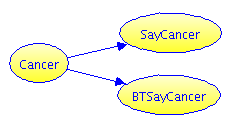

# Mammogram + Blood Test Example

We start from the famous Mammogram problem in the previous example:

>  The probability of breast cancer is 1% for a woman at age forty who participates in routine screening. If a woman has breast cancer, the probability is 80% that she will get a positive mammography ["positive" means apparent detection - not that this is good news]. If a woman does not have breast cancer, the probability is 10% that she will also get a positive mammography. A woman in this age group had a positive mammography in a routine screening. What is the probability that she actually has breast cancer? ___%           [Taken from Gigerenzer & Hoffrage 1995, after Eddy 1982]

But now our clinician knows the answer is only about 7%. That's not
enough to act on, but it justifies a second test. She orders a blood
test, which we assume is totally independent. This particular test
detects 90% of actual cancers, and has a 15% false positive rate.

Let's call this new variables "BTSayCancer" for "blood test says cancer".  

## Influence Diagram and Calculator
Our diagram now looks like this:

<form id="form1">
  <textarea id="editor1" name="editor1" cols="80" rows="100">
  <h2>Specify the probabilities</h2>
    <table>
  <tbody>
    <tr>
      <td>Background rate:</td>
      <td colspan="2">`chance of Cancer is 1%`</td>
    </tr>
    <tr><th>&nbsp;</th><th>Mammogram</th><th>Blood Test</th></tr>
    <tr>
      <td style="font-weight:bold">Hit Rate</td>
      <td>`chance of SayCancer given Cancer = 80%`</td>
      <td>`chance of BTSayCancer given Cancer = 90%`</td>
    </tr>
    <tr>
      <td  style="font-weight:bold">False Alarm Rate</td>
      <td>`chance of SayCancer given no  Cancer = 10%`</td>
      <td>`chance of BTSayCancer given no Cancer = 15%`</td>
    </tr>
    </tbody>
  </table>
<h2>Questions</h2>
<table>
  <tr><th>Question</th><th>Formula</th><th>Expected</th></tr>
  <tbody>
  <tr>
    <td>1. Chance she has cancer, given positive results on both tests?</td>
    <td>`%chance of Cancer given (SayCancer & BTSayCancer)?`</td>
    <td>33%</td>
  </tr>
  <tr>
    <td>2. Chance of cancer given positive mammogram and negative blood
    test?</td>
    <td>`%chance of Cancer given (SayCancer & no BTSayCancer)?` </td>
    <td>1%</td>
  </tr>
  <tr>
    <td>3. Chance of cancer given only a positive blood test? </td>
    <td>`%chance of Cancer given BTSayCancer?`</td>
    <td>6%</td>
  </tr>
  </tbody>
</table>
  </textarea>
  <input id="CalcButton" type="button" value="Calculate" />
  
</form>
 

## Discussion

### Positive Results on Both Tests
Previously we had 8 hits and 99 false alarms. Of the 8 hits, the blood
test detects 7.  Of the 99 false alarms, the blood test
identifies 15. Therefore our chance is now 7/21, or about 33%.

### Positive Mammogram, Negative Blood Test
Of the 8 mammogram hits, the blood test would miss 1.  Of the 99 false
alarms, the blood test would correctly get 84. Therefore our chance of
cancer is 1/85 or about 1%.

### Only a Positive Blood Test
Of 1000 such patients tested, 10 have cancer. Of those, we detect 9.
However, of the remaining 990, we detect 148. Therefore our chances
are 9/157 or about 6%.
