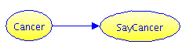

# Mammogram Example

This is a famous example of Bayesian/diagnostic reasoning that has been used in published papers since 1982 (or earlier). It's a very simple problem yet 8 in 10 doctors get it wrong before training. Here's the problem:

>  The probability of breast cancer is 1% for a woman at age forty who participates in routine screening. If a woman has breast cancer, the probability is 80% that she will get a positive mammography ["positive" means apparent detection - not that this is good news]. If a woman does not have breast cancer, the probability is 10% that she will also get a positive mammography. A woman in this age group had a positive mammography in a routine screening. What is the probability that she actually has breast cancer? ___%           [Taken from Gigerenzer & Hoffrage 1995, after Eddy 1982]

## Influence Diagram
There are only two variables. Let us call them Cancer and
SayCancer. Cancer is TRUE when a woman actually has breast
cancer. SayCancer is TRUE when the test indicates cancer (a "positive"
mammography).

 
<form id="form1">
  <textarea id="editor1" name="editor1" cols=80 rows="60">
    <h2>Specify the probabilities</h2>
    <ul>
	<li>Chance of Cancer: \`chance of Cancer = 1%\`</li>
	<li>Hit Rate: \`chance of SayCancer given Cancer = 80%\`</li>
	<li>False Alarm Rate: \`chance of SayCancer given no Cancer = 10%\`</li>
    </ul>
	<h2>Question</h2>
	
What is the probability she actually has cancer, given the positive mammography?

	
Chance of Cancer given SayCancer is: \`%chance of Cancer given SayCancer?\`

	
Chance of -Cancer given SayCancer is: \`%chance of -Cancer given SayCancer?\`

  </textarea>
  <input id="CalcButton" type="button" value="Calculate" />
  
</form>
 

## Discussion
The answer should be about 7% because:

* Of 1,000 women at age forty who participate in routine screening
  * 10 will have breast cancer, of whom we will detect 8
  * 990 will be healthy, of whom we will "detect" 99

So for every 107 detections, only 8 are breast cancer, on average. That is just under 7.5%.

