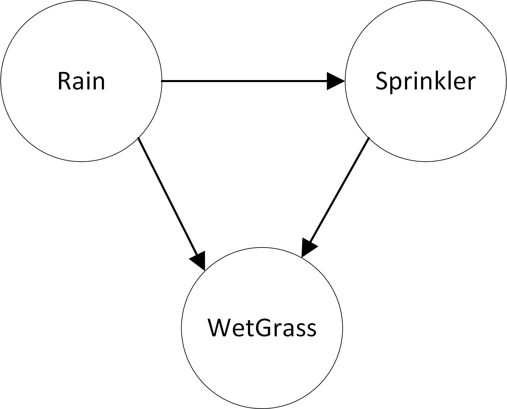

## The Wet Grass problem

</img>

The calculator feature was mostly designed for easy probability calculations.  The formulas for probability can be written in _structured English_ or abbreviated in mathematical form.  For example, we can write:

* \`probability of Raining is 20%\`, or
* \`prob Raining = 0.2\`, or 
* \`pr(Raining)=20%\`  

Note that variables like _Raining_ and _Sprinkler_ need to start with a capital letter.

We can also write conditional probabilities, by using the word "given", or its symbol equivalent -- the quote sign. So, for example:

* The \`probability of Sprinkler given Raining is 1%\`
* The \`probability of Sprinkler given no Raining is 40%\`

A formula like the above could also be abbreviated as "pr(Sprinkler: -Raining)=0.4".  Notice that we also used a logical negation, as in the word "no".  The logic used in conditional probabilities, or we calculate the combination of probabilities, can include the operators "not", "and", "or", as well as their equivalent symbols "-", "&" and "|", respectively.  The "not" operator can also be abbreviated to "no".  The following are some examples:

* The \`probability of Wet given no Raining and no Sprinkler is 0\`
* The \`probability of Wet: Raining & not Sprinkler is 80%\`
* The \`probability of Wet: -Raining & Sprinkler = 90%\`
* \`pr(Wet: Raining & Sprinkler) = 99%\`

Once the probability assignments have been entered, we can calculate other probabilities of interest. For example, we can calculate that the probability of wet grass is "prob Wet"(\`prob Wet\`), or that the "chance of Wet and Sprinkler" equals \`chance of Wet and Sprinkler\`.

In most cases, we would like to display the results of the probability calculations as percentages or whole numbers, rather than decimals.  We can use the keyword "percent" (or its symbol '%') _in front of the probability formula_ to achieve this. For example, "percent chance of Wet and Sprinkler" is \`percent chance of Wet and Sprinkler\`.

## Probability Calculator
And here is the example in the editor.
<form id="form1">
  <textarea id="editor1" name="editor1" cols=80>
    <b>Example probability formulas</b>
    <ul>
    <li> \`probability of Rain is 20%\`</li>
    <li> \`probability of SprinklerOn given Rain is 1%\`</li>
    <li> \`probability of SprinklerOn given no Rain is 40%\`</li>
    <li> \`probability of WetGrass given no Rain and no SprinklerOn is 0%\`</li>
    <li> \`probability of WetGrass given Rain and not SprinklerOn is 80%\`</li>
    <li> \`probability of WetGrass given not Rain and SprinklerOn is 90%\`</li>
    <li> \`probability of WetGrass given Rain and SprinklerOn is 99%\`</li>
    </ul>
    
Based on the above probability statements, we can calculate the probability of WetGrass as \`%prob WetGrass\`
    

  </textarea>
  <input id="CalcButton" type="button" value="Calculate" />
  
</form>
