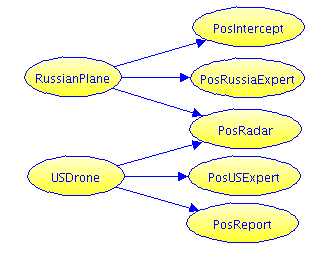

# BARD Black Site Surveillance

The US wants to know if Russia saw its short secret operation on a small remote island. A lookout photographed some possible contrails. 

## Hypotheses
There are two main candidates for the contrails:

* **Russian Spy Plane**: Assumed initial chance of RussianPlane is 10%.
* **US Drone**: Have been known to fly over the island. Initial chance of USDrone is 5%.

## Influence Diagram
We have five sources or reports, constituting the following influence
diagram.

Our evidence looks like this:

Source | Variable | Value | Hit Rate | False Alarm Rate
--- | --- | --- | --- | --- 
Foreign Intelligence Intercept | PosIntercept | TRUE | 85% | 10%
US Report on Drone Activity | PosReport | TRUE | 95% | 5%
Expert on Russian planes | PosRussiaExpert | FALSE | 80% | 40%
Expert on US Drones | PosUSExpert | FALSE | 70% | 20%
Cold War Radar Station | PosRadar | TRUE | 95% vs US, 90% vs Russian | 0.5%

Candidate Explanations (Hypotheses)
    
* `chance of RussianPlane = 10%`
  
* `chance of USDrone is 5%`
  
Note that both or neither could be present
    
## Specify Reliabilities
In the table below, to save space we will abbreviate "given" with a colon (:), and "no" with minus (-).

### Foreign Intercept
* `chance of PosIntercept : RussianPlane is 85%`
* `chance of PosIntercept : -RussianPlane is 10%`
	
### US Report

* `chance of PosReport : USDrone is 95%`
* `chance of PosReport : -USDrone is 5%`
	
	
### Expert on Russian Planes

* `chance of PosRussiaExpert : RussianPlane is 80%`
* `chance of PosRussiaExpert : -RussianPlane is 40%`
	
	
### Expert on US Planes

* `chance of PosUSExpert : USDrone is 70%`
* `chance of PosUSExpert : -USDrone is 20%`
	
### Cold War Radar Station

* `chance of PosRadar : USDrone is 95%`
* `chance of PosRadar : RussianPlane is 90%`
* `chance of PosRadar : -(RussianPlane or USDrone) is 0.5%`
	
## Questions

Sanity Checks:
	
* Prior chance of Russian Plane (should be 10%): `%chance of RussianPlane`
* Prior chance of US Drone (should be 5%): `%chance of USDrone`
	 
1. Chance of Russian Plane, given evidence? (Should be 52-53%): 

  * `%chance of RussianPlane : (PosIntercept & PosReport & PosRadar &  -PosRussiaExpert & -PosUSExpert) ?`

2. Chance of US Drone, given evidence? (Should be 62%): 
  
  * `%chance of USDrone : (PosIntercept & PosReport & PosRadar & -PosRussiaExpert & -PosUSExpert) ?`

3. Chance of both, given evidence? (Should be 15%.)

  * `%chance of (USDrone & RussianPlane) :	PosIntercept & PosReport & PosRadar & -PosRussiaExpert & -PosUSExpert ?`

4. Chance of neither [ ~0.0067 or  ~0.67%]?

  * `chance of -(USDrone or RussianPlane) :	PosIntercept & PosReport & PosRadar & -PosRussiaExpert & -PosUSExpert ?` 
	
If the final line renders as simply "0", our sampling isn't good enough.
